```{r, echo = FALSE}
knitr::opts_chunk$set(cache = TRUE)
```

### Session Outline

* Two parts

  - How can machine learning help statistics?  [**Variational Autoencoder**]
  - How can statistics help machine learning? [**Representation Analysis**]
  
### Learning Process

* Get hands-on experience through simple examples
* Interactive format
* All code examples available here

 
### What is the distinction?

* Statistics and machine learning both study how to learn from data
* Differences reflect community histories

| Statistics                     | Machine Learning              |
|--------------------------------|-------------------------------|
| Origins in mathematics         | Origins in engineering        |
| Connections to philosophy      | Connections to neuroscience   |
| Emphasis on scientific insight | Emphasis on automated systems |

```{r}
library("EBImage")
display(readImage("extra_figures/microarray.png"))
display(readImage("extra_figures/robot.png"))
```

## Part 1: Bayes' Rule and Variational Auto-Encoders

### Inference & Prediction
* Can we make systems that both sense and act?
  * Modern systems directly interface with the world
  * Probabilistic descriptions guide decision making
* We would like our modeling to be fast, probabilistic, and automatic

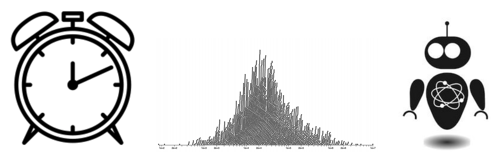

### Classical Bayes
Bayes’ rule
\begin{align*}
p\left(\theta \vert x\right) &= \frac{p\left(x \vert \theta\right)p\left(\theta\right)}{p\left(x\right)} \\
&\propto p\left(x\vert\theta\right)p\left(\theta\right)
\end{align*}

* You have some belief about the world $p(\theta)$
* New information arrives, via $x$
* Update your understanding based on $x$, written as $p(\theta | x)$

### Example: Beta-Binomial

* Task: Identify potential bias in a coin
* Model:
  - Prior: $\theta \sim \text{Beta}\left(a_0, b_0\right)$
  - Likelihood: $x \vert \theta \sim \text{Bin}\left(n, \theta\right)$
* Posterior is still a Beta (derivation on next few slides)

```{r}
display(readImage("extra_figures/prior_drawing.png"))
```

### Example: Beta-Binomial

* Task: Identify potential bias in a coin
* Model:
  - Prior: $\theta \sim \text{Beta}\left(a_0, b_0\right)$
  - Likelihood: $x \vert \theta \sim \text{Bin}\left(n, \theta\right)$
* Posterior is still a Beta (derivation on next few slides)

```{r}
display(readImage("extra_figures/coins_drawing.png"))
```

### Example: Beta-Binomial

* Task: Identify potential bias in a coin
* Model:
  - Prior: $\theta \sim \text{Beta}\left(a_0, b_0\right)$
  - Likelihood: $x \vert \theta \sim \text{Bin}\left(n, \theta\right)$
* Posterior is still a Beta (derivation on next few slides)

```{r}
display(readImage("extra_figures/posterior_drawing.png"))
```

### History: Laplace's Sunrise Problem

In 1814, Pierre-Simon Laplace asked,

> What is the probability that the sun will rise tomorrow?

which is the first place where this Beta-Binomial model appeared.

```{r}
display(readImage("extra_figures/laplace_essay.png"))
```

### Derivation: Prior

The Beta prior density is defined over $\left[0, 1\right]$ and has the form,

$$
p\left(\theta; a_0, b_0\right) \propto \theta^{a_0 - 1}\left(1 - \theta\right)^{b_0 - 1}
$$

The fact that it flexibly parameterizes numbers between $\left[0, 1\right]$
makes it a good candidate for a prior over probabilities.

Q: How does the shape of the density change when you vary $a_0$ and $b_0$?
Hint: This [demo](https://observablehq.com/@herbps10/beta-distribution?collection=@herbps10/probability-distributions)

### Derivation: Likelihood

The binomial distribution is a model for the number of heads $x \in \left\{1,
\dots, n\right\}$ seen after $n$ independent flips of a coin with probability
$\theta$. It has the form,

$$
p\left(x \vert \theta\right) \propto {n \choose x} \theta^{x}\left(1 - \theta\right)^{n - x}
$$
If $\theta = 0.1$, how would this figure change? What about $\theta = 0.9$? ([Hint](https://observablehq.com/@herbps10/binomial-distribution))

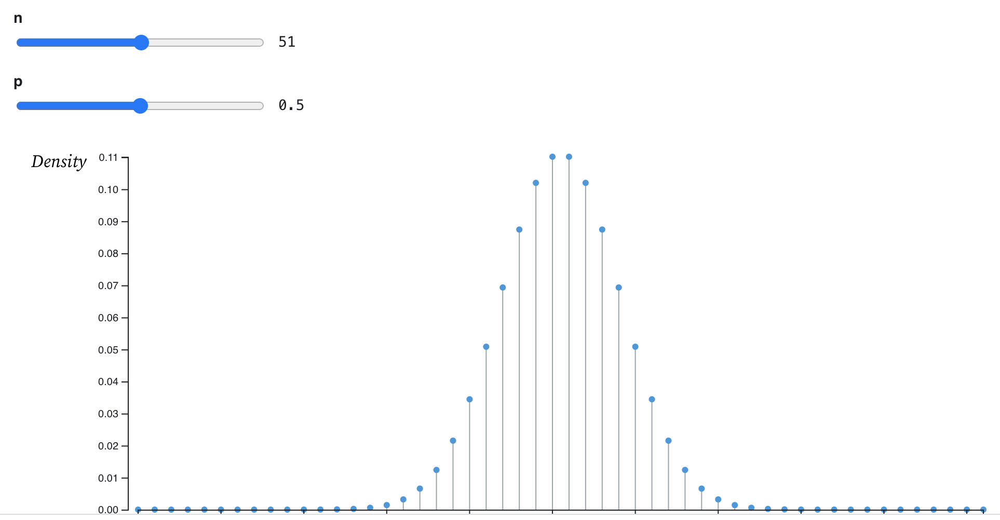

### Derivation: Posterior

Using Bayes' rule, we can compute the posterior,
\begin{align*}
p\left(\theta \vert x\right) &\propto p\left(x \vert \theta\right)p\left(\theta\right) \\
&\propto {n \choose x}\theta^{x}\left(1 - \theta\right)^{n - x}\theta^{a_0}\left(1 - \theta\right)^{b_0} \\
&= \theta^{a_0 + x - 1}\left(1 - \theta\right)^{b_0 + n - x - 1}
\end{align*}
which is still a Beta distribution, but with new parameters $a_0 + x$ and $b_0 +
n - x$. How does its shape change depending on whether $x$ is very large or very
small?

### Simulation

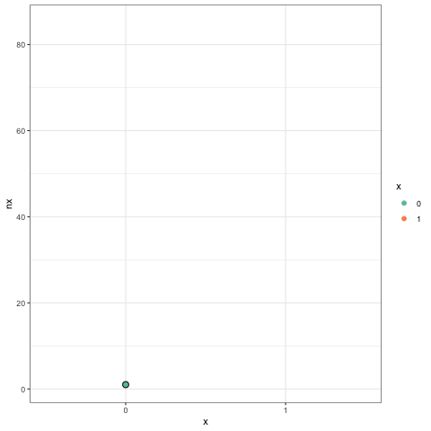 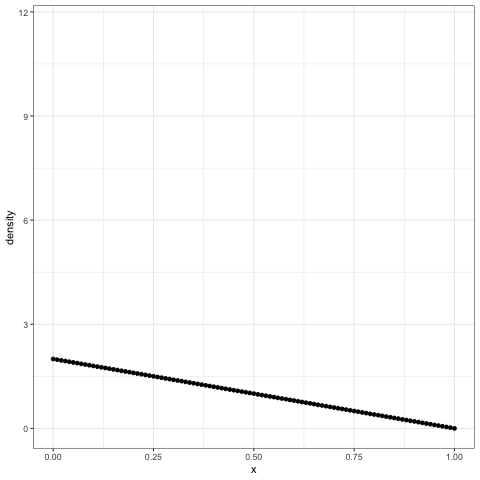

After seeing more and more coin flips, the posterior becomes more sure that the
underlying probability is about 0.2.

### Non-Conjugate Models

* We've just seen an example of conjugacy
* The posterior had the same probability density as the prior
* For _most_ models, we won't be able to arrive at the posterior by pure
mathematical calculation
* Instead, we'll substitute analytical derivations with automatic computation


### The Variational Idea

* Transform a mathematical (integration) problem into an optimization one
* It can be easier to get an approximate posterior than an exact one
  - Restrict optimization to a simpler class

```{r}
display(readImage("extra_figures/variational_idea.png"))
```

The hope is to find $q^{\ast} \in \mathcal{Q}$ that's close to the true
posterior.

### Variational Auto-Encoder (VAE) Model

* Each sample $i$ has some unobserved $z_i$ which summarizes its essential character
* We only observed $x_i$, but it's influenced by $z_i$
* Vocabulary:
  - "Decoding": $z_i \to x_i$
  - "Encoding": $x_i \to z_i$
  
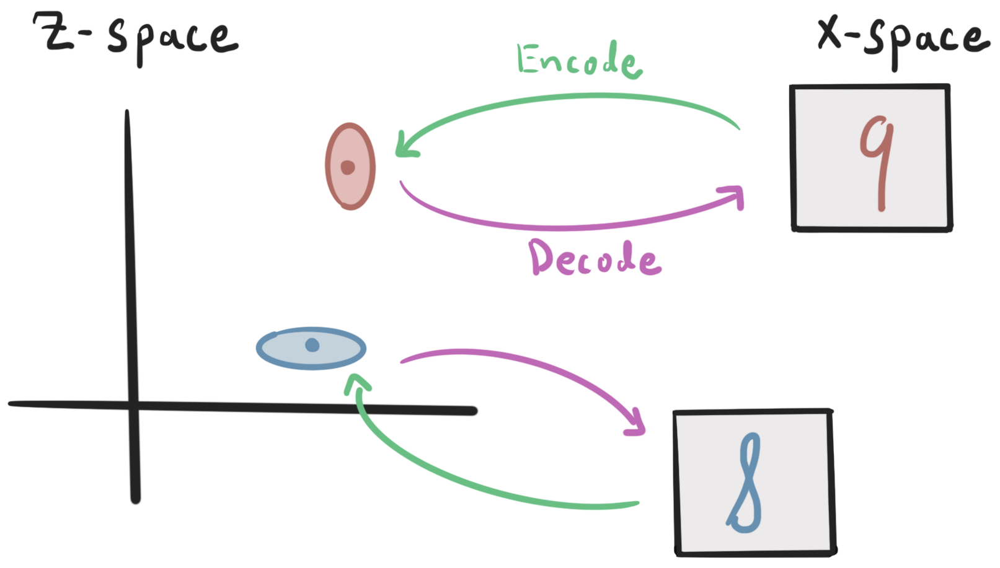
  
### Motivating Example: MNIST

* Observations $x_i$ are handwritten digits
* Latent space $z_i$ summarizes visual features
* Note: This is much higher-dimensional than the beta-binomial example

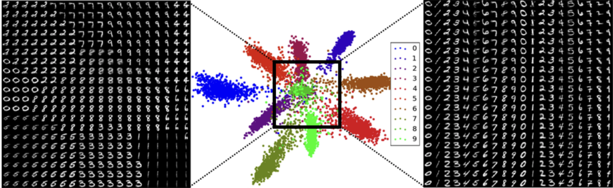

We'll want to arrive at a representation like this. The latent space (center)
clearly distinguishes between different MNIST classes. From a given point in the
latent space, we can generate many different images.

### VAE Model (Decoding)

* If we had never observed $x_i$, we would have a prior $p\left(z\right)$ over $z_i$
* Once we observe $z_i$, we have a likelihood $p_{\theta}\left(x_i \vert z_i\right)$ over $x_i$
* The most common prior-likelihood pair for the VAE is,
\begin{align*}
z_i &\sim \mathcal{N}\left(0, I_{d}\right) \\
x_{i} \vert z_{i} &\sim \mathcal{N}\left(\mu_{\theta}\left(z_i\right), \sigma^{2}_{\theta}\left(z_i\right)\odot I_{d}\right)
\end{align*}
Q: Given $z_i$, what is the correlation between neighboring pixels? Why might
neighboring pixels in $x_i$ have similar values, most of the time?

### Intuition: Decoder

Here $z_i$ is 2D, and determines the shape of the observed digit. $x_i$ is a
vector whose elements correspond to pixels in the image. Different $z_i$'s are
associated with different per-pixel normal distributions, parameterized by
$\mu_{\theta}$ and $\sigma_{\theta}^{2}$.

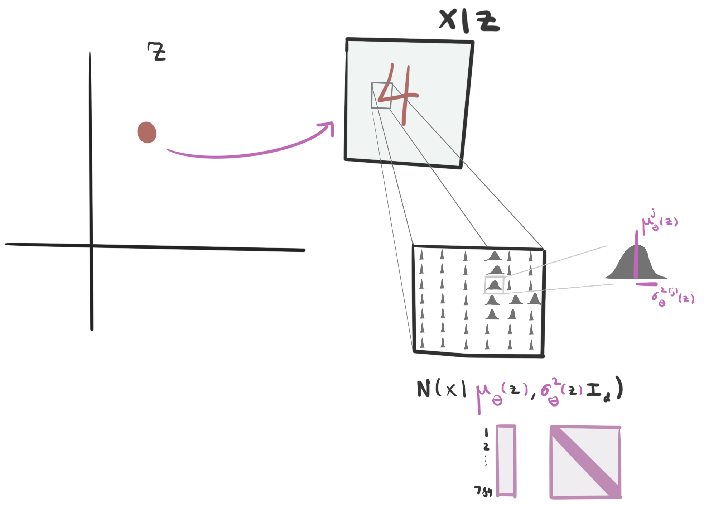

### Intuition: Decoder

Since the decoder defines a distribution $p_{\theta}\left(x_i \vert z_i \right)$
for each fixed $z_i$, we can sample many reconstructions. Since the blue curves
(defined by $\mu_{\theta}$ and $\sigma_\theta$) stay the same, the basic shape
of the digit doesn't change. However, individual pixel values (the green bars)
change.

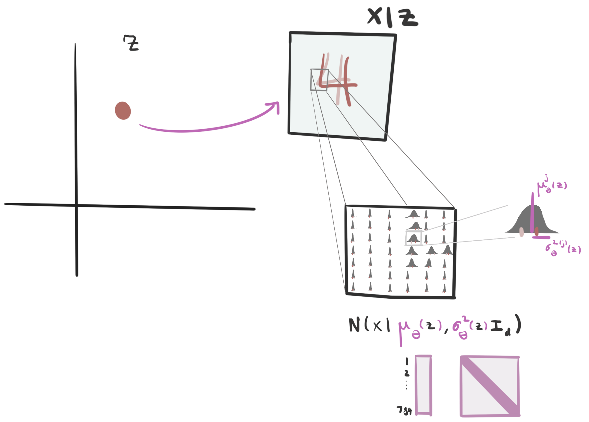

### Intuition: Decoder

Typically, the $z_i$'s will be higher-dimensional (e.g., $d = 20$ in the
original paper). The same intuition carries over, except the $z_i$ have values
along $d$ coordinates.

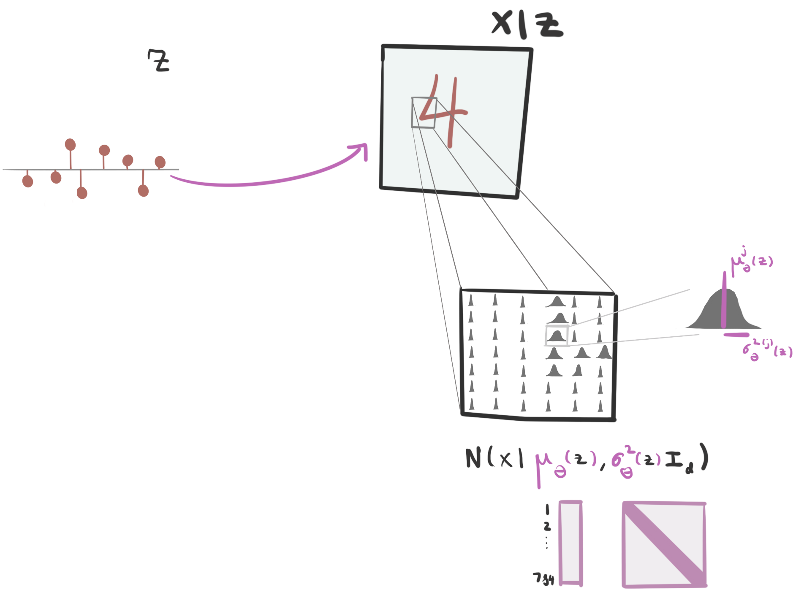

### VAE Model (Encoder)

* Suppose we've observed some $x_i$
* The posterior $p\left(z \vert x\right)$ is not available in closed form
* We'll approximate the posterior using $q_{\varphi}$,
\begin{align*}
p\left(z_i \vert x_i\right) &\approx q_{\varphi}\left(z_i \vert x_i\right) \\
q_{\varphi}\left(z_i \vert x_i\right) &:= \mathcal{N}\left(z_i \vert \mu_{\varphi}\left(x_i\right), \sigma_{\varphi}^{2}\left(x_i\right)\right)
\end{align*}

### Intuition: Encoder

Given a particular image, we update the prior to a posterior in the latent
space. This is an example of the prior.

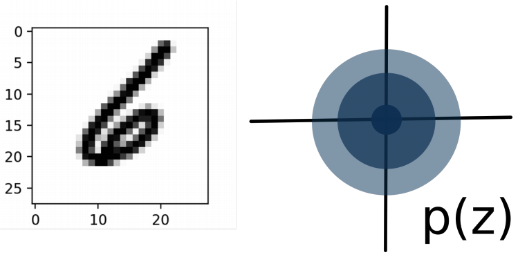

### Intuition: Encoder

The center of the posterior is given by $\mu_{\varphi}\left(x_i\right)$ and the
widths about each axis are given by $\sigma_{\varphi}^2\left(x_i\right)$.


### Intuition: Encoder

Typically the latent space will be more than two dimensional. Here's what the
prior would look like for larger $d$.


### Impelmentation: Encoder

```
# VAE model
class VAE(nn.Module):
    def __init__(self, image_size=784, h_dim=400, z_dim=20):
        super(VAE, self).__init__()
        self.fc1 = nn.Linear(image_size, h_dim)
        self.fc2 = nn.Linear(h_dim, z_dim)
        self.fc3 = nn.Linear(h_dim, z_dim)
        self.fc4 = nn.Linear(z_dim, h_dim)
        self.fc5 = nn.Linear(h_dim, image_size)
        
    def encode(self, x):
        h = F.relu(self.fc1(x))
        return self.fc2(h), self.fc3(h) # (mu, log_var)
    ...
```

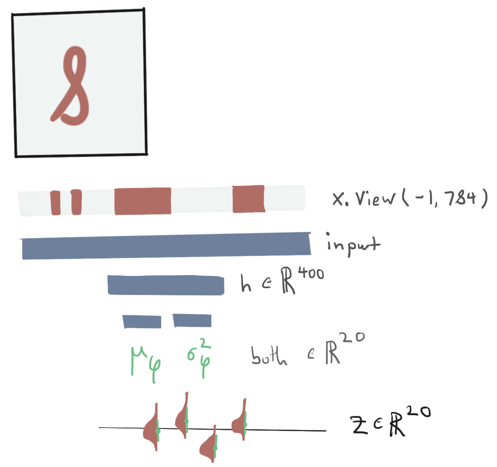

### Example Encodings

Here we are wandering across some path in the latent $z$ space and observing the
associated images $\mu_{\theta}\left(z\right)$. The code used to generate these
samples is
[here](https://colab.research.google.com/drive/1SmI7MY2fiXBnHI_QxSUIw2UDGS-4t0Xt?usp=sharing).

```{r}
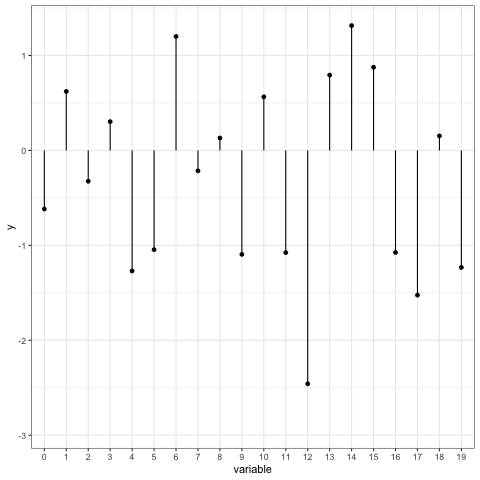
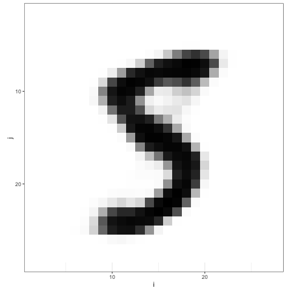
```

### Optimization

* How can we train a VAE model?
  - How to get $\varphi$ to approximate the posterior?
  - How to get $\theta$ to generate images?
* Choose $\theta$ and $\varphi$ to maximize the "Evidence Lower Bound" (ELBO),
\begin{align*}
ELBO\left(\theta, \varphi\right) &= \mathbb{E}_{q_{\varphi}}\left[\log p_{\theta}\left(x_i \vert z_i\right)\right] - D_{KL}\left(q_{\varphi}\left(z_i \vert x_i\right) \vert p\left(z_i\right)\right)
\end{align*}
* This is `reconst_loss + kl_div` in the demo

### Why the ELBO?

* We would like a $\theta$ so that the data have high marginal likelihood
$p_{\theta}\left(x\right)$
* Consider the following expression, which uses the "multiply by 1" trick

\begin{align*}
\log p_{\theta}\left(x\right) &= \mathbb{E}_{q}\left[\log p_{\theta}\left(x\right)\right] \\
&= \mathbb{E}_{q}\left[\log \frac{p\left(x, z\right)}{p_{\theta}\left(z \vert x\right)}\right] \\
&= \mathbb{E}_{q}\left[\log \frac{p_{\theta}\left(x, z\right)}{q\left(z \vert x\right)} \frac{q\left(z \vert x\right)}{p_{\theta}\left(z \vert x\right)}\right] \\
&= \mathbb{E}{q}\left[\log p_{\theta}\left(x \vert z\right)\right] - D_{KL}\left(q\left(z \vert x\right) \vert \vert p\left(z\right)\right) + D_{KL}\left(q\left(z \vert x\right) \vert \vert p_{\theta}\left(z \vert x\right)\right)
\end{align*}

### Studying the bound

\begin{align*}
\log p_{\theta}\left(x\right) &= \color{#6c9fb3}{\mathbb{E}{q}\left[\log p_{\theta}\left(x \vert z\right)\right]} - \color{#de784d}{D_{KL}\left(q\left(z \vert x\right) \vert \vert p\left(z\right)\right)} + \color{#445da5}{D_{KL}\left(q\left(z \vert x\right) \vert \vert p_{\theta}\left(z \vert x\right)\right)} \\
&\geq \color{#6c9fb3}{\mathbb{E}_{q}\left[\log p_{\theta}\left(x \vert z\right)\right]} -\color{#de784d}{ D_{KL}\left(q\left(z \vert x\right) \vert \vert p_{\theta}\left(z\right)\right)}
\end{align*}

* <span style="color: #6c9fb3;">Reconstruction error</span>: How plausible is the observed $x$, averaging over
  encodings $z$ from $q$, and considering the current estimate $\theta$
* <span style="color: #de784d;">Approximation complexity</span>: How far is $q\left(z\vert x\right)$ from the prior?
* <span style="color: #445da5;">Inference quality</span>: How different is the posterior approximation $p\left(z
\vert x\right)$ from the actual posterior?
  - $D_{KL}\geq 0$ for any pair of probabilities
  - Hard to compute, so just drop and turn into an inequality
  
### Optimization

* We will simultaneously optimize $\varphi$ and $\theta$
* However, optimizing $\varphi$ is hard, because you can't just take the gradient step
\begin{align*}
\nabla_{\varphi} \mathbb{E}_{q}\left[\log p_{\theta}\left(x \vert z\right)\right]
\end{align*}

Q: Why not?

### Reparameterization Trick

Optimizing $\varphi$ is hard, because you can't just take the gradient step
\begin{align*}
\nabla_{\varphi} \mathbb{E}_{q_{\varphi}}\left[\log p_{\theta}\left(x \vert z\right)\right]
\end{align*}

Taking the derivative under the integral, we see that
\begin{align*}
\nabla_{\varphi} \mathbb{E}_{q_{\varphi}}\left[\log p_{\theta}\left(x \vert z\right)\right] &= 
\int \log p_{\theta}\left(x \vert z\right) \nabla_{\varphi}q_{\varphi}\left(z \vert x\right) dz
\end{align*}

is no longer an expectation over $q_{\varphi}$, so we can't approximate it using
samples from $q_{\varphi}$.

### Reparameterization Trick

Notice however that 
\begin{align*}
z \vert x &\sim \mathcal{N}\left(z \vert \mu_{\varphi}\left(x\right), \sigma^2_{\varphi}\left(x\right)\right)
\end{align*}
is equivalent to
\begin{align*}
\epsilon &\sim \mathcal{N}\left(0, I\right) \\
z \vert x, \epsilon &\equiv \mu_{\varphi}\left(x\right) + \sigma^2_{\varphi}\left(x\right) \odot \epsilon
\end{align*}
which decouples the source of randomness from the parameters $\varphi$.

### From random to deterministic

Instead of working with multiple gaussian densities (one for each
$\mu_{\varphi}$ and $\sigma_{\varphi}^2$), we work with one and pass it through
different linear transformations.

```{r}
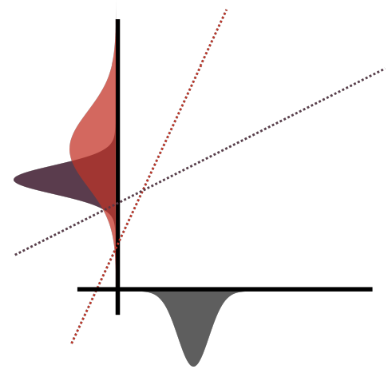
```

### Code Example

```
# VAE model
class VAE(nn.Module):
    def __init__(self, image_size=784, h_dim=400, z_dim=20):
        super(VAE, self).__init__()
       ...
       
    def reparameterize(self, mu, log_var):
        std = torch.exp(log_var/2)
        eps = torch.randn_like(std)
        return mu + eps * std
        
    def forward(self, x):
        mu, log_var = self.encode(x)
        z = self.reparameterize(mu, log_var)
        x_reconst = self.decode(z)
        return x_reconst, mu, log_var
```


### Optimization after Reparameterization

* Since $g_{\varphi}\left(x_i\right) = \mu_{\varphi}\left(x_i\right) +
\sigma_{\varphi}^2\left(x_i\right)$ is deterministic, its gradient can be
approximated,
\begin{align*}
\nabla_{\varphi} \mathbb{E}_{q}\left[\log p_{\theta}\left(x \vert z\right)\right] &= 
\nabla_{\varphi} \mathbb{E}_{p\left(\epsilon\right)}{\log p_{\theta}\left(x \vert g_{\varphi}\left(\epsilon\right)\right)} \\
&= \mathbb{E}_{p\left(\epsilon\right)}{\nabla_{\varphi} \log p_{\theta}\left(x \vert g_{\varphi}\left(\epsilon\right)\right)} \\
&\approx \nabla_{\varphi}\log p_{\theta}\left(x \vert g_{\varphi}\left(\epsilon_{i}\right)\right)
\end{align*}
by sampling many $\epsilon_i \sim p\left(\epsilon\right)$.
* Derivative of $D_{KL}$ term can usually be written in closed form
* So we can optimize the ELBO!

### Code Example

```
for i, (x, _) in enumerate(data_loader):
    # Forward pass
    x_reconst, mu, log_var = model(x)
    
    # Compute reconstruction loss and kl divergence
    reconst_loss = F.binary_cross_entropy(x_reconst, x, reduction="sum")
    kl_div = - 0.5 * torch.sum(1 + log_var - mu.pow(2) - log_var.exp())
    
    # Backprop and optimize
    loss = reconst_loss + kl_div
    optimizer.zero_grad()
    loss.backward()
    optimizer.step()
```

## Part 2: Representational Analysis

### Tools for Introspection

* It's often useful to have tools for introspecting models
  - Can help debug models that don't work
  - ... and help understand models that do
* Science is most effective when you can gather novel observations
  - You can discover beauty in everyday things
  
```{r}
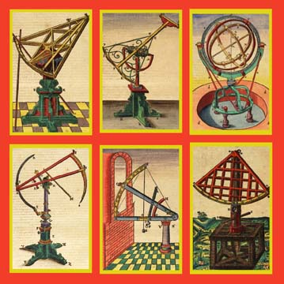
```
  
### Representational Analysis

* Deep learning models learn distributed representations of data
* There are many interesting questions related to these representations
  - How quickly are different layers learned?
  - How do representations compare across models?
  - What are their effective dimensionalities?
  - How do different heuristics (transfer learning, weight normalization, etc.)
  affect learning dynamics?
  
### Plan

* SVCCA gives a way of answering these questions
* We'll introduce it through a simple fully-connected network, and then explain
how to use it for convolutional networks
* In the process, we'll learn about Canonical Correlation Analysis, a classical
statistical method

### Toy Example

* I've simulated data from 5 functions
* Let's learn a function $f: x_i \to \left(y_{i1}, \dots, y_{i5}\right)$
  - One-dimensional input $x_i$
  - Five-dimensional output $\mathbf{y}_{i} := \left(y_{i1}, \dots, y_{i5}\right)$
  
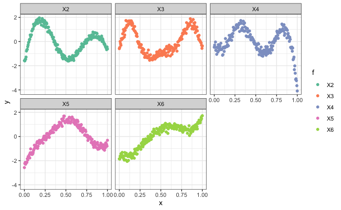
  
### Toy Example

* 1-D input $x_i$
* 5-D output $y_i$
* Four fully connected Linear + ReLU models in between

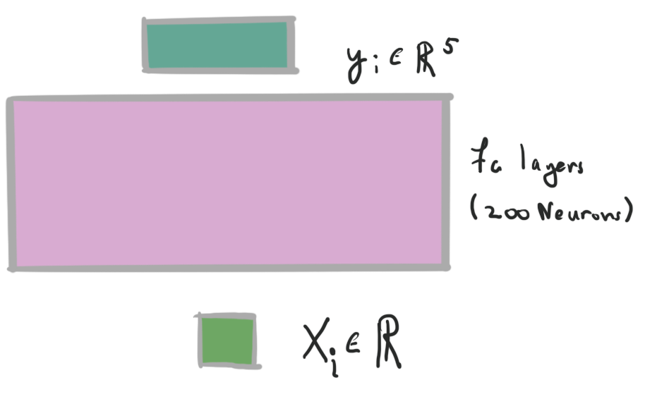

### Training

This is what the fitted function looks like as we train it. A colab notebook
with all the code is
[here](https://colab.research.google.com/drive/16lBEZRU4IEvhApbb_SZmFm1k-YrUATvB?usp=sharing).


### Representations

We can plot the activations for different layers (and at different stages of
learning). Each row gives the activations for a particular neuron. Each column
gives a value of $x_i$. It looks like groups of neurons activate when the data
lie in particular regions of the input space.


### Representations

This is what the second layer looks like at convergence.

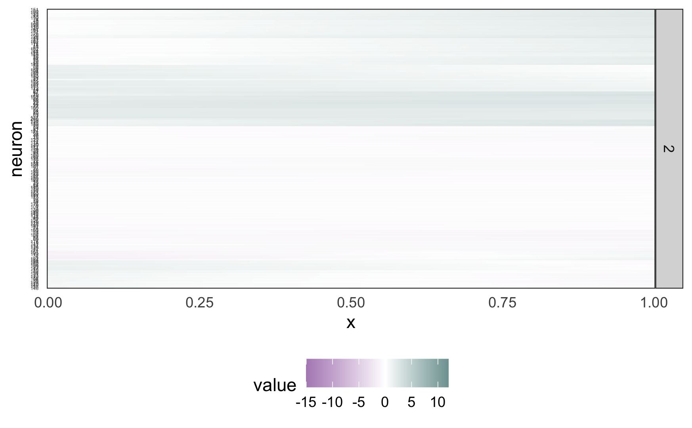

### Representations

Here is the final layer, but before the model has fully converged.

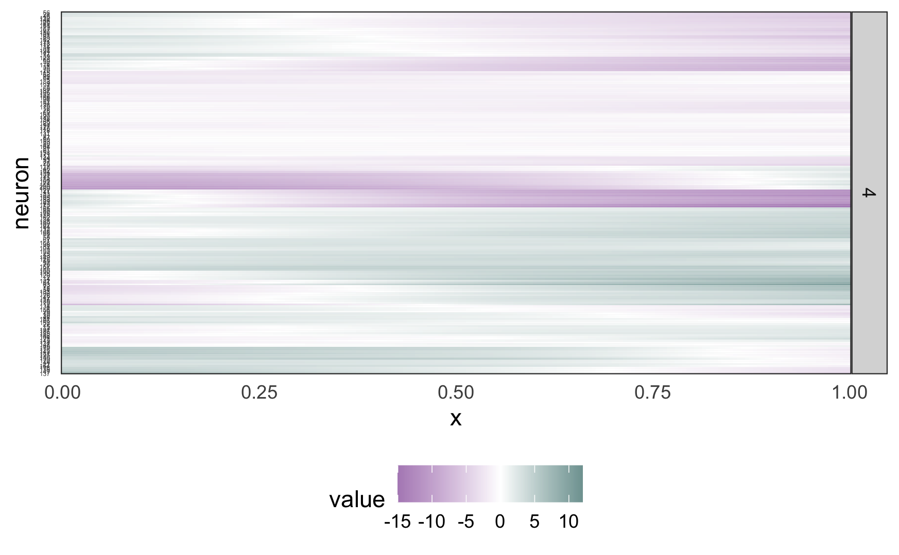  

### Formalization

* Plots are nice, but is there a simpler (and quantitative) way to describe what
we see?
* We can measure the similarity between pairs of matrices
* _Each of the plots above is just a matrix_

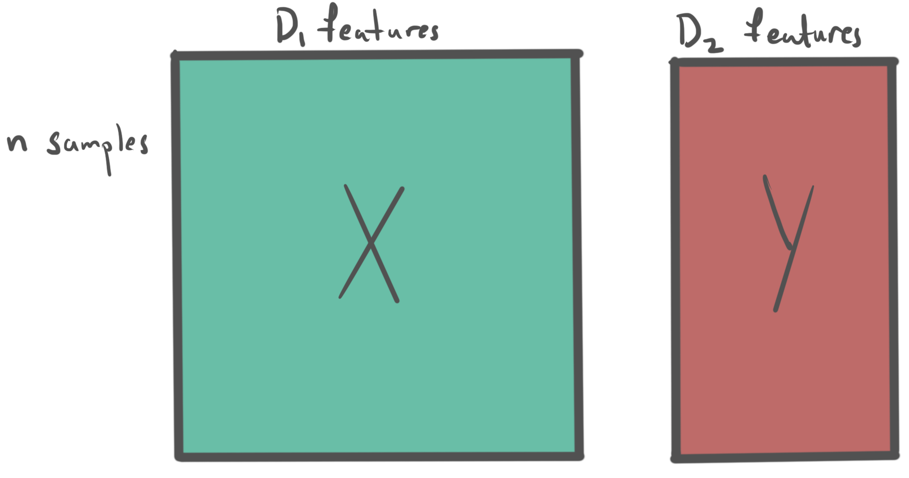
  
### Canonical Correlation Analysis (CCA)

* CCA is a classical method for comparing two tables of data
  - Generalizes the one-dimensional correlation coefficient
* Originally developed to study problems in economics
  - Analysis of prices and demand for multiple crops at once
  
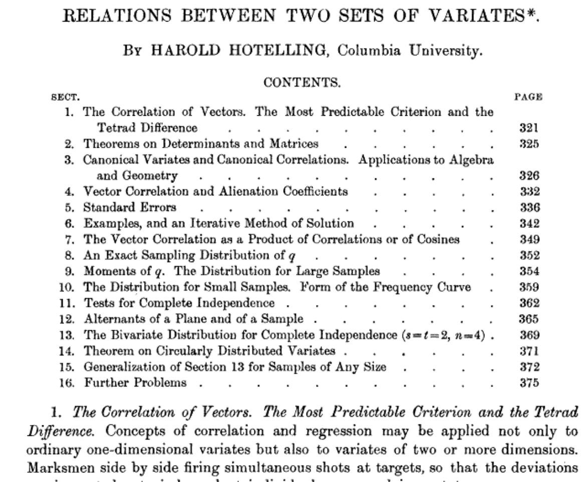

### CCA Geometry

* To derive it, consider the "dual" plot of a dataset, where you plot columns
rather than rows.
  - View matrix as $D$ vectors in $n$-dimensional space
  - _Not_ (the usual) $n$ points in $D$-dimensional space
* Q: What were the dimensions of the matrices I've plotted?

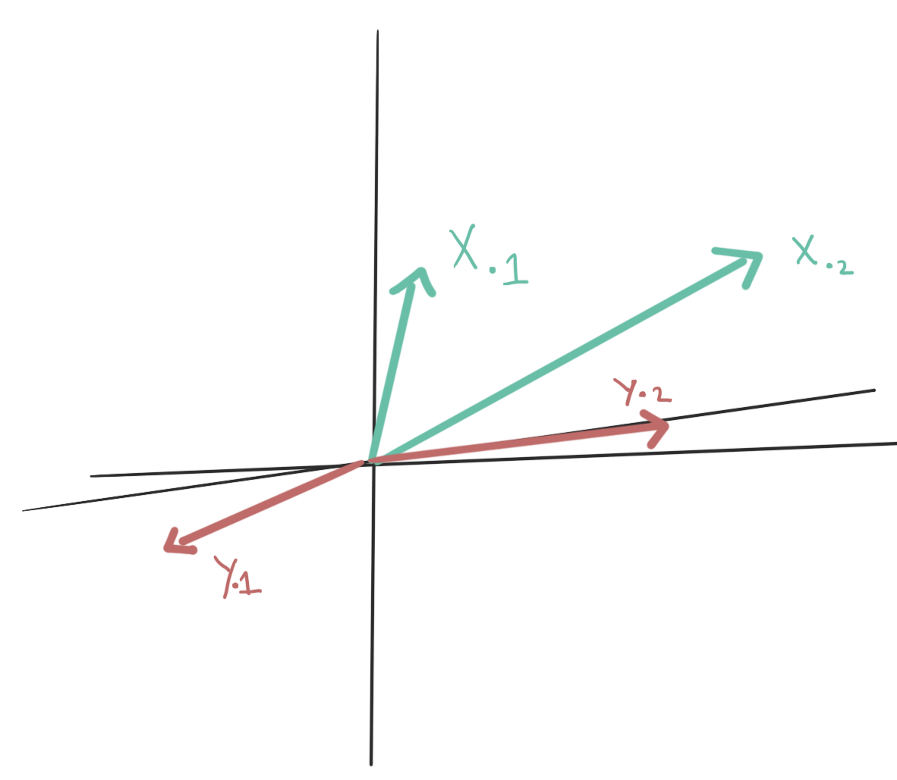

### CCA Geometry

* The columns of each matrix span a subspace
  - Imagine there are $D_{p}$ vectors in an $n$ dimensional space
* Q: How can we measure the similarity of these subspaces?

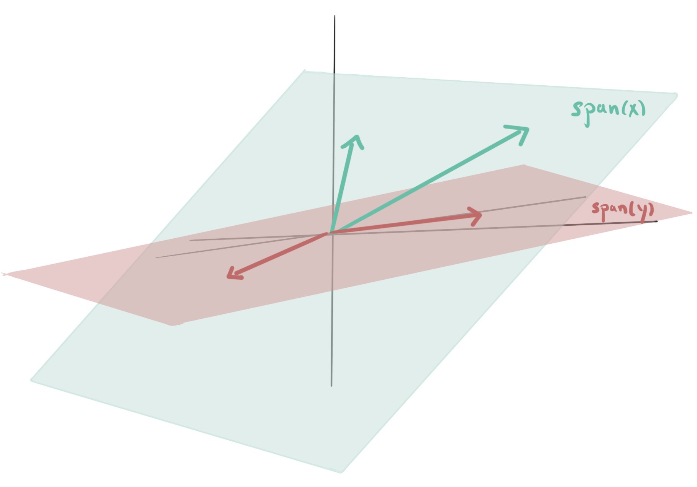
  
### CCA Geometry

* CCA finds the pair of directions that minimize the angle between the subspaces
  - Subject to the directions lying at fixed distance from the origin


### Canonical Correlation Analysis (CCA)

* Mathematically, we can find these direction using the following optimization
problem
\begin{align*}
\rho := \arg \min_{u, v} & \left< Xu, Yv \right> \\
\text{subject to } &\|Xu\|_{2} = 1 \\
 &\|Yu\|_{2} = 1
\end{align*}
* If you orthogonalize $X$ and $Y$ with respect to $u$ and $v$, you can repeat
this process and find a whole sequence of $\rho_{1}, \rho_{2}, \dots \rho_{K}$.

### Interpretation

* The resulting $Xu$ and $Yv$ are linear combinations of the columns of $X$ and
$Y$ that are similar to one another
* Intuition: $u$ and $v$ show which columns of $X$ and $Y$ measure the same
underlying phenomenon
  - If you gather a sequence 
  $\left(u_{1}, v_{k}\right), \dots, \left(u_{K}, v_{K}\right)$, you can study
  $K$ phenomena at once
  
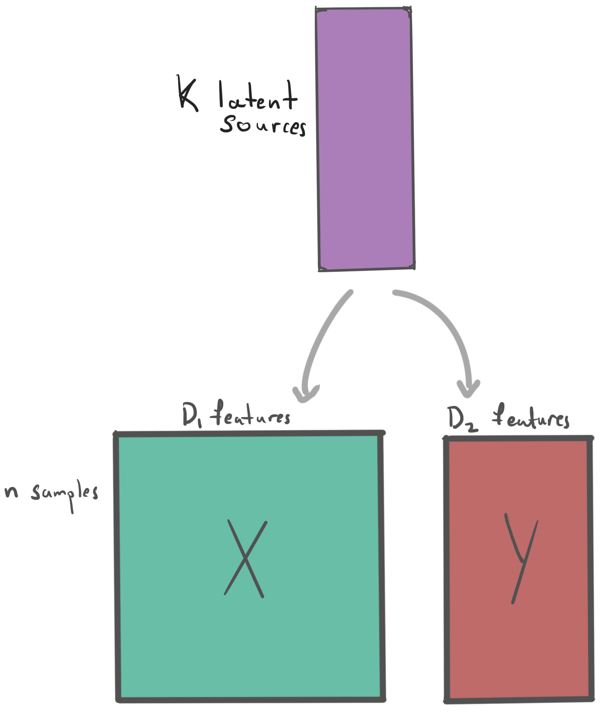

### Back to Deep Learning

* We can try to perform CCA on the activation matrices from before
* This approach is computationally expensive though, because there are many neurons
* Idea: First reduce the dimensionality of the activation matrices using the
Singular Value Decomposition

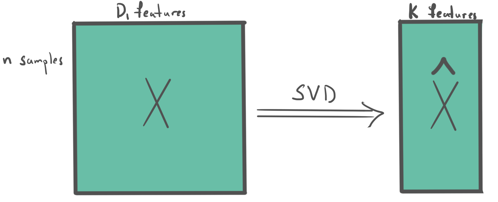

### Why the Singular Value Decomposition (SVD)?

* The SVD finds a lower-dimensional subspace along which most of the data lie
  - View the $n$ samples in a $D$-dimensional space, and find a $K$-dimensional
  subspace that approximates the points
* The effective dimensionality of the activations matrix is often small
  - Most of the samples' activations lie along a low-dimensional subspace
  
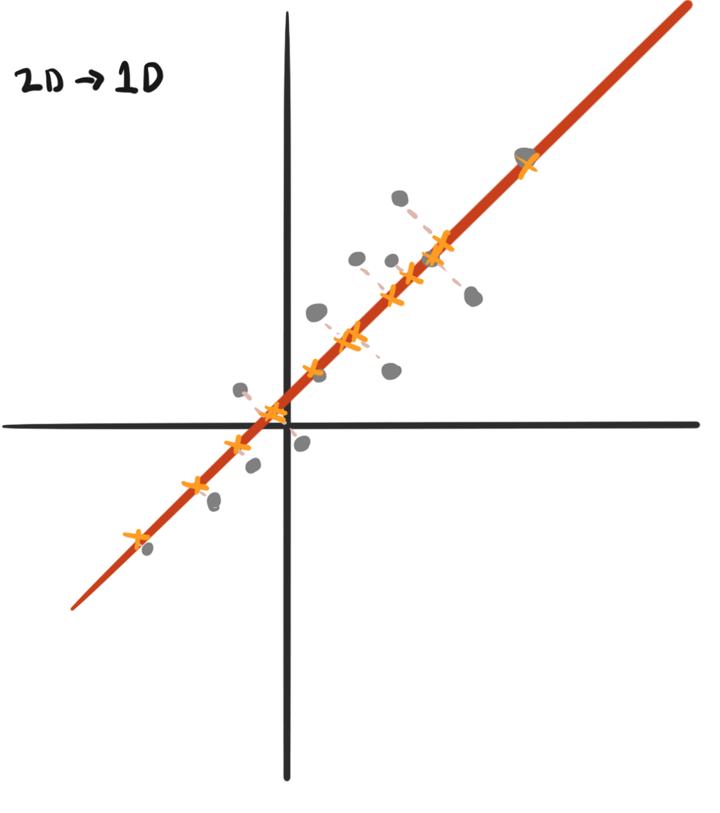

### SVCCA Recipe

* If we use SVD before running CCA, then computation is faster and more stable
* To compare two representations / epochs / models, you can use the following
recipe
  - Extract activations into $n \times D_{1}$ and $n \times D_{2}$ matrices $X$
  and $Y$, respectively
  - Reduce $X$ and $Y$ to their SVD reductions $\hat{X}$ and $\hat{Y}$
  - Perform CCA between $\hat{X}$ and $\hat{Y}$

For a concise summary of the similarity between $X$ and $Y$, use the average
$\rho_{k}$ across several directions.

### Examples: Layer 2 across epochs

* Two matrices are activations at 50 and 1200 epochs
* Estimated SVCCA $\rho_{k}$'s is on the bottom
  - Average similarity is the red line
* Takeaway: Layer 2's subspace has converged after 50 epochs

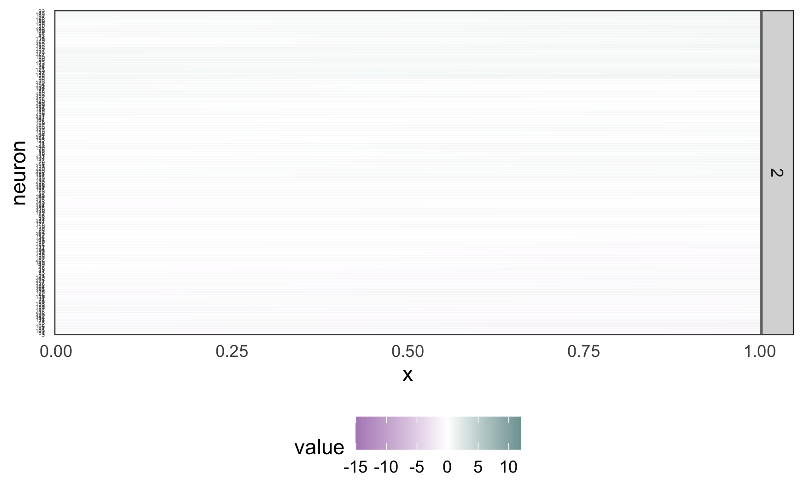    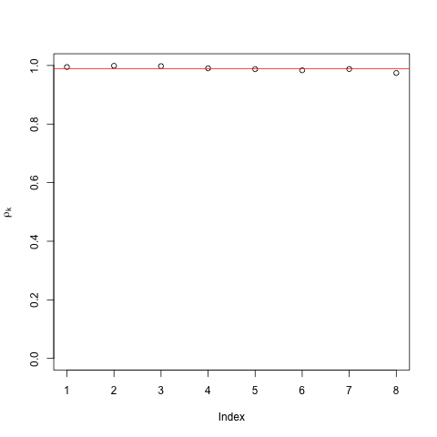 

### Examples: Layer 4 across epochs

* Layer 4's subspace takes longer to train

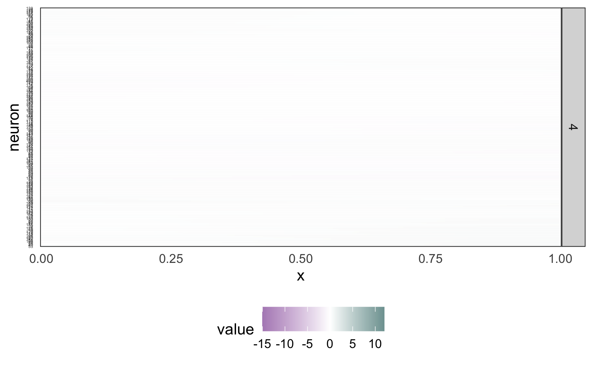    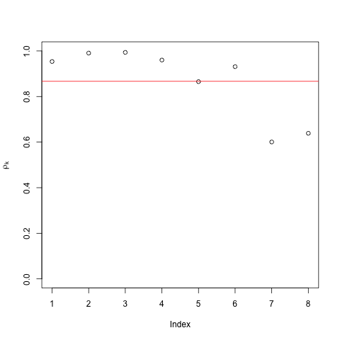 

### Examples: Layer 2 vs. 4

* Difference across layers is larger than difference across training

     

### Real-world Application

One compelling example of this method is to the study of representations learned
by deep learning systems used in medical applications. A [representation
analysis](https://arxiv.org/abs/1902.07208) makes it clear that transfer
learning is most useful for the lower layers in the network and that
higher-level layers change substantially during fine-tuning.

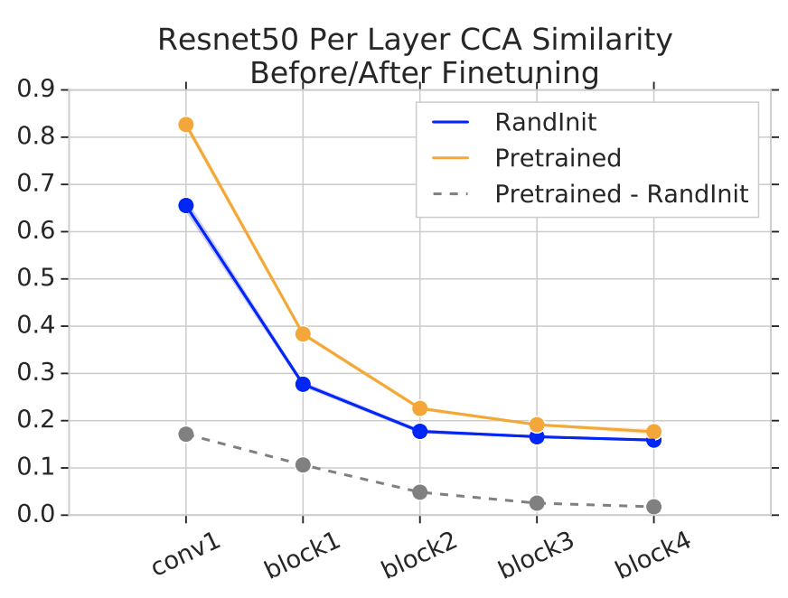

# Conclusion

### Review

* Variational Auto-Encoder
  - We motivated the theory using Beta-Binomial model
  - Built intuition through pictures
  - Got hands-on experience through MNIST
* Singular Vector Canonical Correlation Analysis
  - Motivated the problem by looking at activation maps
  - Developed theory by visualizing different subspaces
  - Got hands-on experience through regression problem
  
### Other topics in Statistics and ML

* There are many other topics we could talk about
  - [Hypothesis testing and GANs](https://research.fb.com/wp-content/uploads/2017/04/neural_tests.pdf?)
  - [Predictive Inference](https://arxiv.org/abs/1905.02928)
  - [Empirical Bayes and Metalearning](https://www.youtube.com/watch?v=A0a1M61gjgI)

### Perspectives on Statistics and ML

* [On Statistical Thinking in Deep Learning A Blog Post](https://imstat.org/wp-content/uploads/bulletin/ml-LONG_On_Statistical_Thinking_in_Deep_Learning.pdf) by Yee Whye Teh
* [A statistical view of deep learning](http://blog.shakirm.com/wp-content/uploads/2015/07/SVDL.pdf) by Shakir Mohamed
* [Comments on Michael Jordan's Essay "The AI Revolution Hasn't Happened Yet](https://hdsr.mitpress.mit.edu/pub/djb16hzl/release/3) by Emmanuel Candes, John Duchi, and Chiara Sabatti

### Last Word

* People seem to enjoy categorizing different types of knowledge
  - E.g. what's the difference between AI and ML? or ML and Statistics? or
  Statistics and Data Science?
  - Story: You can learn a lot more about a person by letting them speak, rather
  than trying to categorize them
* However, our attention should be focused on questions that we care about
  - Try to become comfortable drawing on tools from across disciplines
  